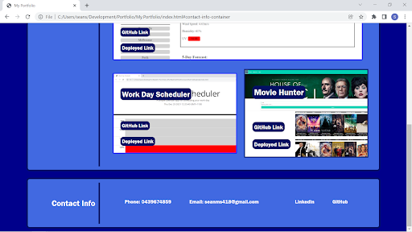

# My Portfolio

This was created to display a portfolio and web applications so that a potential employer can view what projects the potential employee has created. The employer can see whether or not they employee is a suitable candidate for a job application.

The portfolio consists that has a navbar that has links to the different sections of the page. A downloadble PDF link. Each work item has a link to the deployed page and the GitHub page. There is a contact info section at the bottom of the page that has various ways to contact the employee.

HTML and CSS were used in the making of the portfolio page.

Deployed Link: https://seanscott95.github.io/My.Portfolio/
GitHub Link: https://github.com/seanscott95/My.Portfolio 