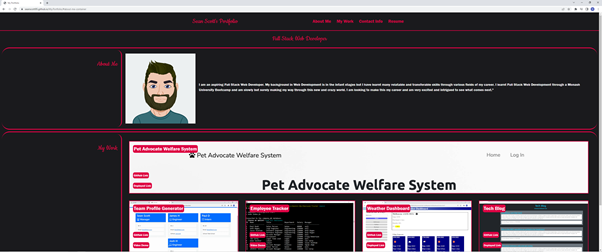
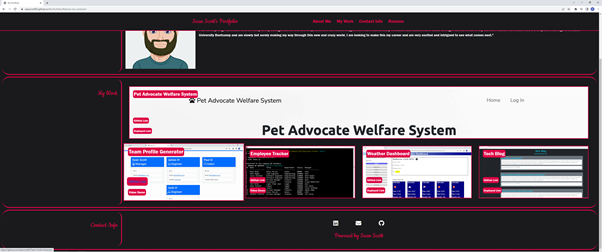
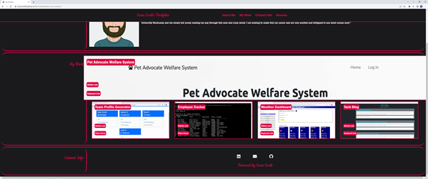

# My Portfolio 

(NOTE: This is my old portfolio that I've decided to leave up for employee's to see the progress of my abilities.)

---
## Table of Contents 
- [Description](#Description)
- [Screenshots](#Screenshots)
- [License](#License)
- [Contribution](#Contribution)
- [Questions](#Questions)
- [Links](#Links)

## Description
This portfolio was created to display my work and web applications so that a potential employer can view what projects I have created. This allows the employer to see whether or not I am a good match for their company whether that comes down to skill or technologies used. 

The portfolio displays a responsive navbar created using Bootstrap. The navbar also has a created custom class to keep up the continuity of the color scheme. The Navbar has links to the different sections of the page and a downloadble PDF link of my Resume. Each work item has a link to their deployed and GitHub pages. There is also a contact info section at the bottom of the page that has various ways to contact me.

Technologies used in the making of my portfolio page include HTML, CSS, Bootstrap.

## Screenshots

Top half of Portfolio

- 

Bottom half of Portfolio

- 

Hovering over link

- 

Containers change with screen size

- 

Navbar links become a burger if screen size is too small

- 

Bottom half of Portfolio on a small screen

- 

## License 

 This application is covered under the:

- [MIT-License](https://opensource.org/licenses/MIT)

## Contribution 

 None.

## Questions 

 To reach me with additional questions please contact me via one of the following methods: 

- GitHub: [GitHub](https://github.com/seanscott95)
- Email: [Email](mailto:seanms418@gmail.com)
- LinkedIn: [LinkedIn](https://www.linkedin.com/in/sean-scott-18ba07225/)

## Links
- GitHub: [GitHub](https://github.com/seanscott95/My.Portfolio)
- Deployed: [Deployed](https://seanscott95.github.io/My.Portfolio/)
